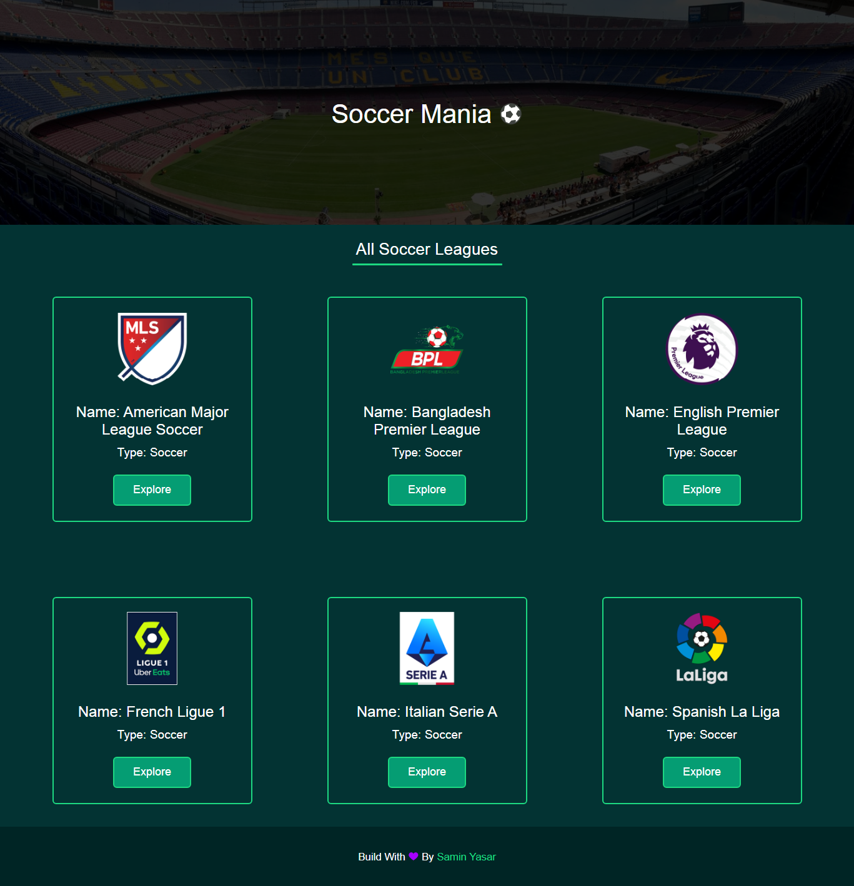

# **Soccer Mania ⚽**

[](https://saminyasar.netlify.app/)
[](https://www.facebook.com/saminyasar004/)
[](https://www.facebook.com/saminyasar04/)
[](https://instagram.com/saminyasar004/)
[](https://twitter.com/saminyasar004/)
[](https://stackoverflow.com/users/14735945/samin-yasar)
[](https://github.com/saminyasar004/)



Soccer Mania is a tiny website where you can see some well known soccer leagues and their teams in details with a visual preview.

## **Technologies**

Technologies used in this Project mentioned below:

```bash
1. HTML5
2. CSS3
3. SCSS
4. Vanilla JS
5. Netlify
```

## **Feautures**

```
1. User can see some well known leagues visual details.
1. User can also see some teams of those leagues and do some visual interactions
2. User can see a team's details
3. There is no reloading so user can't be bored
```

## **Live Site Link**

[Soccer Mania](https://soccer-mania.netlify.app/, "Soccer Mania Live Site")

### Happy Coding 🚀
